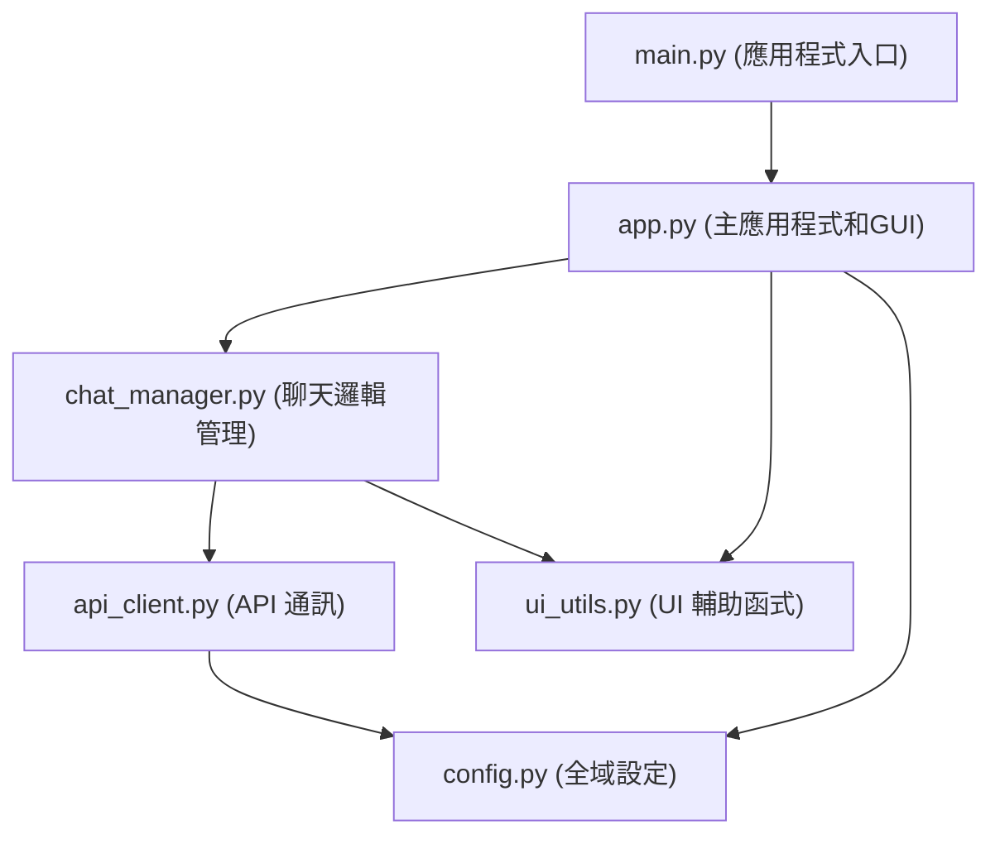

# AI 聊天視窗應用程式

一款基於大型語言模型 (LLM) 的桌面聊天應用程式，提供直觀的互動介面、多模型支援以及豐富的自訂選項，旨在為使用者帶來流暢、高效的 AI 對話體驗。

## 主要功能

*   🚀 **多模型支援**: 可選擇多種先進的語言模型 (例如 DeepSeek 系列, Qwen, Llama 等)，滿足不同場景需求。
*   💬 **即時串流對話**: AI 回應以串流方式即時顯示，提供流暢無縫的對話體驗。
*   🎨 **自訂介面字體大小**:
    *   提供多種預設字體大小選項 (例如：小型 0.8x, 中型 1.0x, 大型 1.5x, 特大 3.0x)。
    *   支援使用者自訂縮放比例，範圍從 0.1x 至 3.0x，精確到小數點後一位。
*   📝 **對話歷史管理**:
    *   自動於記憶體中保存當前對話記錄。
    *   支援將完整對話歷史 (包含時間戳、角色、模型資訊) 導出為易於閱讀的文字檔案 (.txt)。
    *   提供一鍵清除目前對話歷史的功能。
*   🌡️ **溫度參數調節**: 允許使用者調整模型的「溫度」參數 (範圍 0.0 至 1.0)，以控制回應的確定性與創意度。
*    GUI **便利操作**:
    *   聊天內容顯示區域支援右鍵選單，提供「複製選取內容」和「全選」功能。
    *   可即時「停止」AI 當前的回應生成，避免冗餘輸出。
*   💡 **狀態與提示**:
    *   應用程式視窗底部設有狀態列，即時顯示目前操作狀態 (例如：就緒、處理中、API 錯誤、網路錯誤等)。
    *   清晰的錯誤提示與操作指引。

## 系統需求

*   Python 3.7 或更高版本
*   `aiohttp` 套件 (用於非同步 API請求)

## 安裝與設定

1.  **安裝依賴套件**:
    開啟您的終端機或命令提示字元，執行以下指令安裝必要的 `aiohttp` 套件：
    ```bash
    pip install aiohttp
    ```

2.  **設定 API 權杖 (API Token)**:
    **本應用程式使用 [chutes.ai](https://chutes.ai/) 提供的 AI 服務 API**，您需要：

    *   **方式一：使用環境變數 (建議)**
        設定一個名為 `LLM_API_TOKEN` 的環境變數，其值為您的 API 權杖。
        ```bash
        # Windows 命令提示字元 (CMD)
        set LLM_API_TOKEN=your_api_token_here

        # Windows PowerShell
        $env:LLM_API_TOKEN = "your_api_token_here"

        # Linux / macOS (Bash/Zsh 等)
        export LLM_API_TOKEN=your_api_token_here
        ```

    *   **方式二：使用本地設定檔**
        1.  在專案根目錄下，複製 `config_local.py.example` 檔案，並將副本重新命名為 `config_local.py`。
        2.  使用文字編輯器打開 `config_local.py` 檔案。
        3.  將您的 API 權杖填入 `LOCAL_API_TOKEN` 字串變數中，例如：
            ```python
            # config_local.py
            LOCAL_API_TOKEN = "your_api_token_here" # 權杖格式通常以 cpk_ 開頭
            ```
    **重要提示**:
    *   **優先順序**: 如果同時設定了環境變數和本地設定檔中的 API 權杖，程式將 **優先使用環境變數** `LLM_API_TOKEN` 的值。
    *   **安全性**: 請務必妥善保管您的 API 權杖。`config_local.py` 檔案已被預設添加到 `.gitignore` 中，以防止意外將包含敏感權杖的檔案提交到版本控制系統 (如 Git)。

## 如何執行

在完成上述安裝與設定步驟後，於專案根目錄下執行以下指令即可啟動 AI 聊天視窗應用程式：
```bash
python main.py
```

## 程式碼結構

本應用程式採用模組化設計，將不同功能分散到各個獨立的 Python 檔案中，以提高程式碼的可讀性、可維護性和可擴展性。主要模組如下：

*   `main.py`: 應用程式的 **主入口點**。它負責導入 `app` 模組並呼叫其 `main` 函式來啟動程式。
*   `app.py`: 包含 **主應用程式邏輯** 和 **圖形使用者介面 (GUI)** 的 Tkinter 實現。負責視窗佈局、元件創建、事件綁定以及與其他模組的協調。
*   `chat_manager.py`: **聊天核心邏輯管理器**。負責管理對話歷史的儲存與讀取、處理使用者訊息的發送、與 `api_client` 協作獲取 AI 回應、控制回應的開始與停止，以及更新 UI 狀態。
*   `api_client.py`: **AI 服務 API 通訊客戶端**。封裝了與後端 LLM API 進行通訊的所有細節，包括建構 API 請求、處理串流回應、錯誤處理以及非同步網路操作 (使用 `aiohttp`)。
*   `ui_utils.py`: **使用者介面輔助函式庫**。提供一系列與 UI 相關的通用工具函式，例如建立標準化的右鍵選單、生成自訂對話框、設定文字框為唯讀但可選取狀態、格式化時間字串等。
*   `config.py`: **全域設定與常數模組**。定義了應用程式中使用的各種靜態配置訊息，如應用程式版本號、預設字體大小、支援的模型列表、API 端點 URL、UI 顏色主題等。同時也包含獲取和驗證 API 權杖的輔助函式。
*   `config_local.py.example` / `config_local.py`: 本地 API 權杖設定檔的範本檔案及使用者實際的設定檔 (此檔案不受版本控制，用於儲存個人 API 權杖)。

## 架構概覽

以下是應用程式主要模組之間的依賴關係示意圖：


*(註：`config_local.py` 由 `config.py` 中的函式間接讀取，用於獲取本地 API 權杖。)*

## 介面元素說明 (示意圖)

*(由於 Markdown 格式限制，此處無法直接展示 GUI 截圖。請使用者執行應用程式以查看實際介面。)*

應用程式的主要介面通常包含以下幾個區域：

*   **標題區域**: 顯示應用程式名稱和版本號。
*   **聊天顯示區**: (位於中央，佔據大部分空間) 用於展示使用者與 AI 之間的完整對話歷史，包含時間戳、發言者角色 (您/AI模型名稱) 及訊息內容。支援垂直捲動。
*   **模型與參數設定區**: (通常位於聊天顯示區下方或側邊)
    *   **模型選擇**: 提供單選按鈕或下拉選單，讓使用者選擇要互動的 AI 模型。
    *   **溫度控制**: 滑桿及對應的數值顯示，用於調節 AI 回應的「溫度」參數。通常附有簡短說明文字。
    *   **字體大小調整**: 提供預設的字體大小選項 (如小型、中型、大型、特大) 及一個自訂輸入框 (附帶「倍」字樣)，讓使用者調整整體介面的字體縮放比例。
*   **使用者輸入區**: (通常位於視窗底部) 一個多行文字輸入框，供使用者輸入問題、指令或任何想對 AI 說的話。支援 `Enter` 鍵發送訊息，`Shift+Enter` 換行。
*   **功能按鈕區**: (通常與使用者輸入區相鄰)
    *   **發送按鈕**: 點擊後將輸入區的內容發送給 AI。
    *   **停止按鈕**: 在 AI 正在生成回應時變為可用，點擊可中斷當前回應。
    *   **清除歷史按鈕**: 點擊後會跳出確認對話框，確認後將清除目前的聊天顯示內容及相關歷史記錄。
    *   **導出記錄按鈕**: 點擊後會開啟檔案儲存對話框，讓使用者將目前對話歷史保存為文字檔案。
*   **狀態列**: (位於視窗最底部) 一條橫幅，用於顯示應用程式的目前狀態，如「就緒」、「正在處理請求...」、「API 權杖無效」、「網路連線錯誤」等。

## 注意事項

1.  **API 權杖安全**: API 權杖是您存取 AI 服務的憑證，請務必妥善保管，切勿洩露給他人或提交到公開的程式碼倉庫中。
2.  **字體大小影響**: 調整字體大小設定會同步影響應用程式中所有 UI 元素的文字大小，以保持介面的一致性。
3.  **歷史記錄導出內容**: 導出的聊天歷史檔案會包含詳細的對話資訊，包括每條訊息的時間戳、發言者角色 (使用者或 AI 模型名稱) 以及訊息的完整內容。
4.  **溫度參數的影響**: 「溫度」參數控制模型輸出的隨機性。較低的溫度值 (如 0.0-0.3) 會使模型產生更具確定性、更保守和更一致的回應；較高的溫度值 (如 0.7-1.0) 則會鼓勵模型產生更有創意、更多樣化，但有時也可能不夠連貫或偏離主題的回應。請根據您的需求選擇合適的溫度值。
5.  **網路連線**: 本應用程式需要穩定的網路連線才能與遠端 AI 模型服務進行通訊。如果遇到連線問題，請檢查您的網路設定。

## 已知問題

*   **彈出視窗位置問題**: 目前部分系統提示對話框 (如清除歷史確認框) 可能不會自動居中於主視窗顯示，我們將在後續版本中改進視窗定位機制。

## 待優化項目

*   **API token 數量設置**: 
    * API 回應token 數量即時調整
*   **UI 優化**: 
    * 彈窗按鈕顏色
    * 對話框編碼調整嘗試
